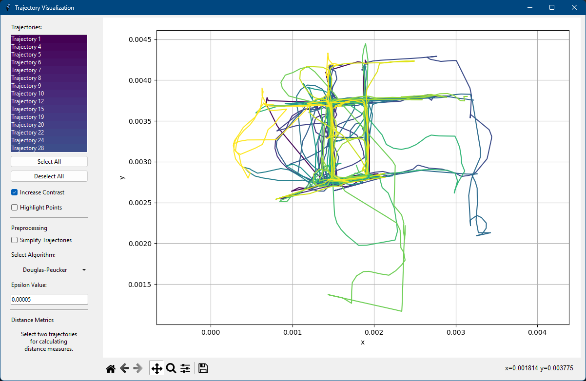

# trajectory-analysis-2023

Project by Hamidreza Behbood, Arsalan Razavi and Karl Felix Schewe for the 2023 course Trajectory Analysis at the University of Münster.



## Installation

Before you begin, ensure that you have Python 3.7 or newer installed on your system.

1. Create a virtual environment:

    ```bash
    python -m venv venv
    ```

2. Activate the virtual environment. This depends on your operating system:

    * Linux/macOS:

        ```bash
        source venv/bin/activate
        ```

    * Windows:

        ```cmd
        venv\Scripts\activate
        ```

    More information can be found in the official [documentation](https://docs.python.org/3/library/venv.html#how-venvs-work). In Visual Studio Code you can select the virtual environment by searching with ``str`` +  ``shift`` +  ``p`` for ``Python: Select Interpreter``.

3. Install the required packages in the newly created virtual environment:

    ```bash
    pip install -r requirements.txt
    ```

## Running the program

To run the program, execute the following command:

```bash
python src/main.py
```

In the ``src`` directory you can find the package ``app`` which implements core functionalities for reading and analysing trajectories. Included in ``src`` are also scripts with examples for specific functions.

Functions can be imported like this:

```Python
from app.functions import *
```

## Testing

For running tests, just type:

```bash
pytest
```
